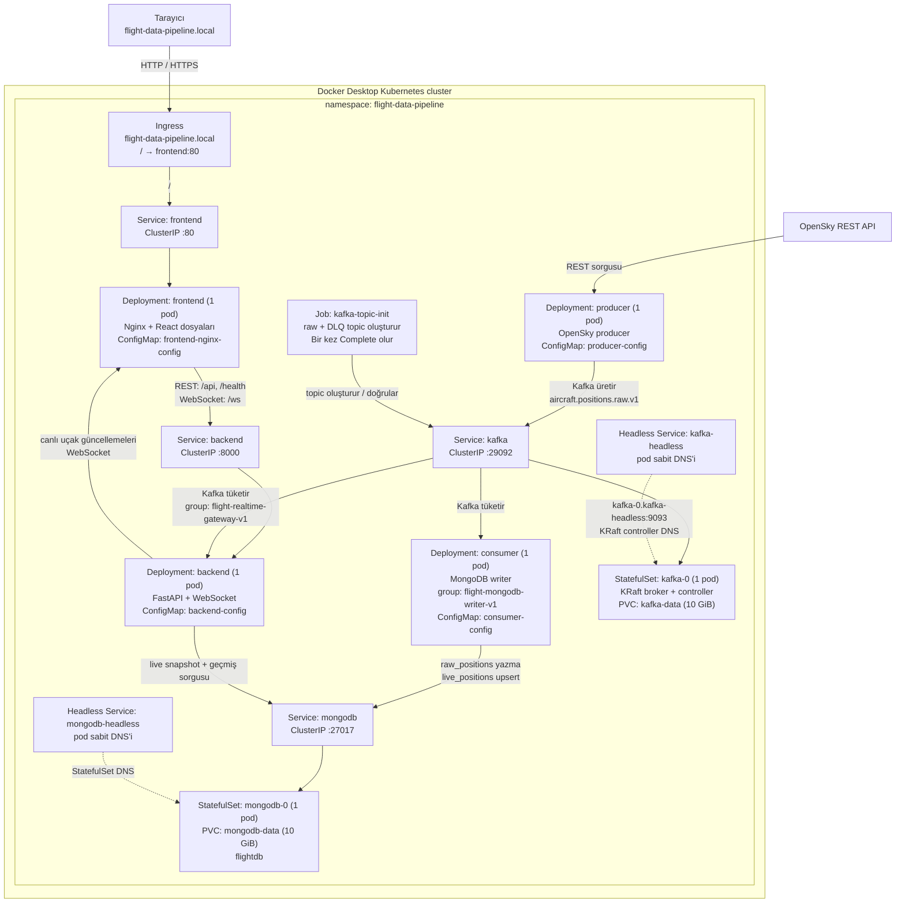

# Kubernetes Mimari Görseli

Bu görsel, `k8s/lesson-05` içindeki tam sistem manifestlerinin yerel Docker Desktop
Kubernetes kümesinde kurduğu yapıyı anlatır. Tüm uygulama kaynakları
`flight-data-pipeline` namespace'i içindedir.

## Nasıl okunur?

1. **Dış giriş:** Tarayıcı yalnızca `Ingress` üzerinden frontend'e gelir. Ingress,
   `frontend` Service'i üzerinden frontend pod'una yönlendirir.
2. **API katmanı:** Frontend iç ağda `backend:8000` adresine konuşur. Nginx
   ConfigMap'i `/api`, `/health` ve `/ws` isteklerini backend Service'ine proxy eder.
3. **Veri üretimi:** Producer, OpenSky'den aldığı konumları Kafka'daki
   `aircraft.positions.raw.v1` topic'ine gönderir. `kafka-topic-init` Job'u bu topic'i
   (ve hata kayıtları için DLQ topic'ini) başlangıçta hazırlar.
4. **İki bağımsız tüketici:** Consumer bütün mesajları MongoDB'ye kalıcı olarak yazar;
   backend ise ayrı consumer group ile aynı topic'i okuyup WebSocket istemcilerine canlı
   olarak yayınlar. Group isimleri farklı olduğundan mesaj paylaşmazlar; ikisi de her
   mesajı görür.
5. **Kalıcı veriler:** Kafka ve MongoDB `StatefulSet` kullanır. Pod yeniden başlasa
   bile kendisine ait PVC diski korunduğu için veri kalır. Headless Service'ler,
   StatefulSet pod'larının sabit DNS adları içindir; normal ClusterIP Service'ler ise
   uygulamaların kullandığı basit adreslerdir (`kafka`, `mongodb`).

## Arıza halinde ne olur?

- Bir **Deployment** pod'u çökerse Kubernetes yeni bir pod başlatır.
- Kafka veya MongoDB pod'u yeniden oluşursa, ilgili **PVC** sayesinde diskteki veri
  korunur.
- Backend geçici olarak kapalıysa frontend WebSocket'i yeniden bağlanır; ilk durumunu
  `live_positions` üzerinden REST ile tekrar alır.
- Consumer hata alırsa offset'i yazım başarılı olmadan commit etmez; yeniden başlatınca
  mesajı tekrar işleyebilir. MongoDB upsert tasarımı tekrar işlemeyi güvenli hale getirir.

## Gerçek manifest karşılıkları

- Uygulama kaynakları: `k8s/lesson-05/*-deployment.yaml`
- Kalıcı servisler: `k8s/lesson-05/kafka-statefulset.yaml` ve
  `k8s/lesson-05/mongodb-statefulset.yaml`
- Ağ: `*-service.yaml`, `*-headless-service.yaml`, `ingress.yaml`
- Ayarlar: `*-configmap.yaml`
- Başlangıç işi: `kafka-topic-init-job.yaml`
